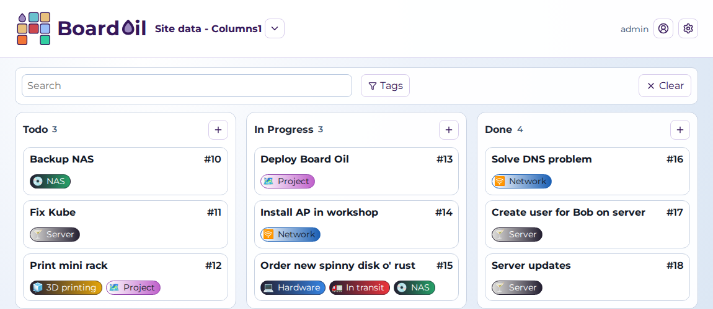

# BoardOil

BoardOil is a self-hosted Kanban board mostly meant for my home lab environment,  I use it to plan tech projects, gardening, and even a wedding.



See more at [https://boardoil.dozigden.com](https://boardoil.dozigden.com).

Key features:
Multiple boards with basic RBAC.
It's got a REST API and MCP server.

It's written in .NET and Vue3.  I deploy it myself via Docker, so that's had the most testing.

> Warning
> While I rely on this project for much of my own work it is mostly a learning experience. Use at own risk.

## Quick Start - Docker compose
The docker-compose.yml pulls the latest published image.

You will need to be authenticated to the GitHub registry in Docker, see https://docs.github.com/en/packages/working-with-a-github-packages-registry/working-with-the-container-registry#authenticating-with-a-personal-access-token-classic

If you're doing anything more than just trying it out you should set the signing key, and turn off insecure cookies once you're running https; both are in the environment settings of the compose file.

### Data volume

The SQLite database is kept in the data volume.  On release of a new version, before the database is updated, a backup copy is made within a 'backups' folder, backups older than 30 days are deleted.

You should backup the data volume as you see fit.

## Development

### Local build
Restore/install:

```bash
dotnet restore BoardOil.slnx
cd BoardOil.Web && npm install
```

Run backend + frontend:

```bash
./dev-startall.sh
```

### Compose
`docker-compose.dev.yml` builds the image from the local source tree and tags it as `boardoil:dev`.  Use it for testing local Docker builds:

```bash
docker compose -f docker-compose.dev.yml up --build -d
```
