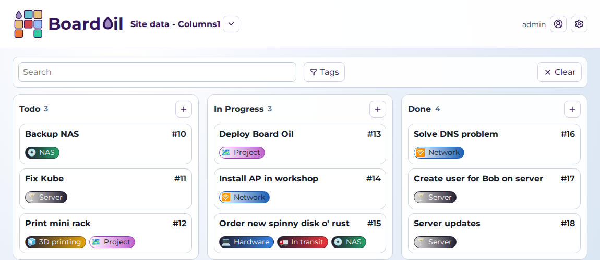

# BoardOil

BoardOil is a self-hosted Kanban board mostly meant for my home lab environment,  I use it to plan tech projects, gardening, and even a wedding.  Try the [live demo](https://boardoil.dozigden.com).




See more at [https://boardoil.dozigden.com](https://boardoil.dozigden.com).

Key features:
Multiple boards with basic RBAC.
REST API and MCP server.

It's written in .NET and Vue3.  I deploy it myself via Docker, so that's had the most testing.

> Warning
> While I rely on this project for much of my own work, use at own risk.

## Quick Start

See [Getting Started with BoardOil](GETTING_STARTED.md) to get BoardOil running with Docker.


## MCP

See [Connect an MCP Client to BoardOil](MCP.md) for MCP setup instructions.

### Data volume

The data volume contains the SQLite database and generated authentication signing key. Before a database update, BoardOil makes a backup in the `backups` folder; backups older than 30 days are deleted.

You should back up the complete data volume as you see fit.

## Development

### Local build
Restore/install:

```bash
dotnet restore BoardOil.slnx
cd BoardOil.Web && npm ci
```

Run backend + frontend:

```bash
./dev.sh
```

or

```powershell
./dev.ps1
```

### Compose
`docker-compose.dev.yml` builds the image from the local source tree and tags it as `boardoil:dev`.  Use it for testing local Docker builds:

```bash
docker compose -f docker-compose.dev.yml up --build -d
```
